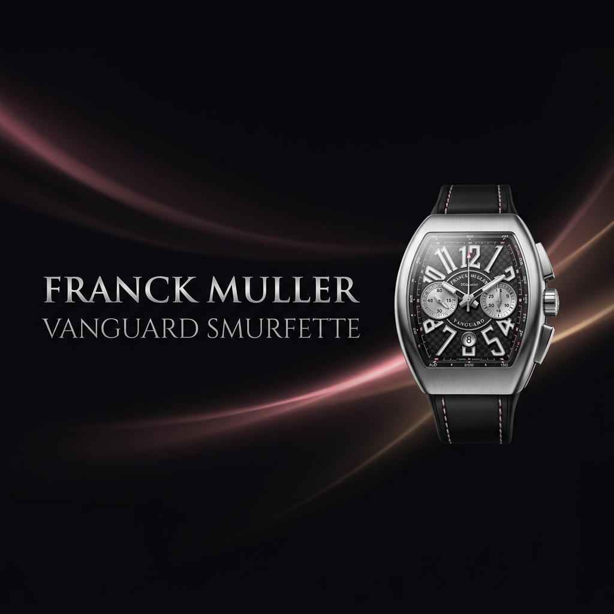
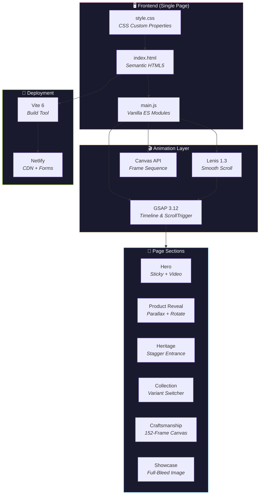

<div align="center">

<!-- ═══════════════════════════════════════════════════════════════════════
     ANIMATED SVG HEADER
     ═══════════════════════════════════════════════════════════════════════ -->



<br/>

<!-- ANIMATED TYPING EFFECT -->
<a href="https://git.io/typing-svg"></a>

<br/>

<!-- BADGE ROW -->

&nbsp;

&nbsp;


<br/><br/>

<!-- TECH STACK BADGES -->


<br/><br/>

<!-- REPO STATS -->


<br/><br/>

[**🌐 Live Demo**](https://luxury-watch-brand.netlify.app) · [**📋 Report Bug**](https://github.com/AHMEDALIGHORI/sveston-webpage/issues) · [**✨ Request Feature**](https://github.com/AHMEDALIGHORI/sveston-webpage/issues)

</div>

<br/>

<!-- ═══════════════════════════════════════════════════════════════════════
     ANIMATED DIVIDER
     ═══════════════════════════════════════════════════════════════════════ -->


<br/>

## 📖 Table of Contents

<details open>
<summary><b>Navigate the README</b></summary>
<br/>

- [🎯 About The Project](#-about-the-project)
- [✨ Key Features](#-key-features)
- [🎨 Design System](#-design-system)
- [🏗️ Architecture](#️-architecture)
- [🛠️ Tech Stack](#️-tech-stack)
- [⚡ Quick Start](#-quick-start)
- [📁 Project Structure](#-project-structure)
- [🎬 Sections Overview](#-sections-overview)
- [🎭 Animation Specifications](#-animation-specifications)
- [📱 Responsive Design](#-responsive-design)
- [🚀 Deployment](#-deployment)
- [🔧 Customization](#-customization)
- [📄 License](#-license)

</details>

<br/>

<!-- ═══════════════════════════════════════════════════════════════════════
     ABOUT THE PROJECT
     ═══════════════════════════════════════════════════════════════════════ -->

## 🎯 About The Project

<div align="center">
<table>
<tr>
<td>

**A fully immersive, production-ready luxury watch brand single-page website** crafted for the **Franck Muller Vanguard Smurfette** limited edition. This isn't a template — it's a cinematic digital experience built from the ground up with scroll-driven animations, frame-by-frame canvas sequences, and a design language that rivals the watch it showcases.

Every pixel, every transition, every interaction has been engineered with the same obsessive attention to detail that defines Franck Muller's horological masterpieces.

</td>
</tr>
</table>
</div>

<br/>

> [!NOTE]
> This project is built for the **Vanguard Smurfette Edition** — a limited run of 88 individually numbered timepieces featuring a 32mm stainless steel case, self-winding Swiss movement, and 75 meticulously assembled components.

<br/>

<!-- ═══════════════════════════════════════════════════════════════════════
     KEY FEATURES
     ═══════════════════════════════════════════════════════════════════════ -->

## ✨ Key Features

<div align="center">

<table>
<tr>
<td width="50%">

### 🎬 Cinematic Hero
Full-viewport looping video with GSAP entrance timeline — scale, parallax, and staggered reveals create an opening worthy of a luxury brand.

</td>
<td width="50%">

### 🖼️ Frame-by-Frame Canvas
152 sequential JPEG frames scrubbed via scroll position on an HTML5 canvas — a cinematic product reveal tied directly to the user's scroll.

</td>
</tr>
<tr>
<td width="50%">

### 🔄 Variant Switcher
Animated two-state slider between Blue Guilloché and Rose Pink variants with GSAP-powered cross-fade transitions and background swaps.

</td>
<td width="50%">

### 📜 Scroll-Driven Animations
Every element enters the viewport with intentional motion — parallax backgrounds, rotating product shots, and staggered text reveals.

</td>
</tr>
<tr>
<td width="50%">

### 🎫 Reservation Modal
Premium-feeling overlay form with Netlify-compatible submission, variant selection, body scroll lock, and keyboard accessibility.

</td>
<td width="50%">

### 🧈 Smooth Scrolling
Lenis-powered inertia scrolling synchronized with GSAP ScrollTrigger for buttery-smooth navigation and precise animation timing.

</td>
</tr>
</table>

</div>

<br/>

<!-- ═══════════════════════════════════════════════════════════════════════
     DESIGN SYSTEM
     ═══════════════════════════════════════════════════════════════════════ -->

## 🎨 Design System

<div align="center">

### Color Palette

<table>
<tr>
<td align="center"><br/><b>Primary</b><br/><code>#f7a1c6</code></td>
<td align="center"><br/><b>Gold</b><br/><code>#d4af7a</code></td>
<td align="center"><br/><b>Blue</b><br/><code>#5bb3e4</code></td>
<td align="center"><br/><b>Background</b><br/><code>#0b0b0b</code></td>
<td align="center"><br/><b>Text</b><br/><code>#ffffff</code></td>
<td align="center"><br/><b>Footer</b><br/><code>#050505</code></td>
</tr>
</table>

### Typography

| Role | Font | Weights | Usage |
|:---:|:---:|:---:|:---|
| 📰 **Serif** | `Playfair Display` | 400, 700, italic | Dramatic headings, hero titles, stats |
| 📝 **Sans** | `Inter` | 300, 400, 500, 600 | Body text, descriptions, form inputs |
| 🏷️ **Accent** | `Outfit` | 300, 400, 600 | Labels, buttons, eyebrows, nav links |

### Design Principles

</div>

```
 ┌────────────────────────────────────────────────────────────────┐
 │  01  DARK-FIRST        Every section on near-black. Always.   │
 │  02  FULL-BLEED         100vh sections. No padding gaps.      │
 │  03  CINEMATIC OVERLAYS Gradients maintain text readability.   │
 │  04  TYPOGRAPHY HIERARCHY Three fonts, three distinct roles.   │
 │  05  GOLD & PINK        Secondary accents, CTAs, dividers.    │
 │  06  MOTION IS KING     Every element animated intentionally.  │
 │  07  STICKY HERO        Pins behind content for depth.         │
 │  08  INTERACTIVE VARIANT Two-state product switcher.           │
 │  09  FRAME CANVAS       Scroll-driven 152-frame sequence.     │
 │  10  MODAL CONVERSION   Premium overlay, not a separate page.  │
 └────────────────────────────────────────────────────────────────┘
```

<br/>

<!-- ═══════════════════════════════════════════════════════════════════════
     ARCHITECTURE
     ═══════════════════════════════════════════════════════════════════════ -->

## 🏗️ Architecture



<br/>

<!-- ═══════════════════════════════════════════════════════════════════════
     TECH STACK
     ═══════════════════════════════════════════════════════════════════════ -->

## 🛠️ Tech Stack

<div align="center">

| Layer | Technology | Version | Purpose |
|:---:|:---:|:---:|:---|
| ⚡ | **Vite** | `^6.3` | Lightning-fast build tool & dev server |
| 🎭 | **GSAP** | `^3.12` | Timeline animations & ScrollTrigger |
| 🧈 | **Lenis** | `^1.3` | Smooth inertia scrolling engine |
| 📜 | **Vanilla JS** | `ES2024` | Zero-framework, pure ES modules |
| 🎨 | **CSS3** | — | Custom properties, Grid, Flexbox |
| 📄 | **HTML5** | — | Semantic markup, Canvas API |
| 🚀 | **Netlify** | — | CDN deployment + form handling |

</div>

<br/>

<!-- ═══════════════════════════════════════════════════════════════════════
     QUICK START
     ═══════════════════════════════════════════════════════════════════════ -->

## ⚡ Quick Start

### Prerequisites


### Installation

```bash
# 1. Clone the repository
git clone https://github.com/AHMEDALIGHORI/sveston-webpage.git

# 2. Navigate to project directory
cd luxury-watch-brand

# 3. Install dependencies
npm install

# 4. Start the development server
npm run dev
```

> The site will be available at `http://localhost:5173/`

### Build for Production

```bash
# Create optimized production build
npm run build

# Preview the production build locally
npm run preview
```

<br/>

<!-- ═══════════════════════════════════════════════════════════════════════
     PROJECT STRUCTURE
     ═══════════════════════════════════════════════════════════════════════ -->

## 📁 Project Structure

```
luxury-watch-brand/
│
├── 📄 index.html              ← Single-page HTML (all 8 sections + modal)
├── 🎨 style.css               ← Complete CSS architecture (custom properties)
├── ⚡ main.js                 ← GSAP animations, Lenis, modal, nav logic
├── 📦 package.json            ← Vite + GSAP + Lenis dependencies
│
└── 📂 public/
    ├── 🎬 hero-video.mp4      ← Full-screen hero background video
    └── 📂 assets/
        └── 📂 photo/
            ├── 🖼️ logo.svg        ← Brand logo (SVG, white)
            ├── 🖼️ bg1.png         ← Product reveal background
            ├── 🖼️ watch.png       ← Product reveal watch render
            ├── 🖼️ ethos-bg.png    ← Collection BL variant background
            ├── 🖼️ ethos-bg-rs.png ← Collection RS variant background
            ├── 🖼️ ethos-watch.png     ← Collection BL variant watch
            ├── 🖼️ ethos-watch-rs.png  ← Collection RS variant watch
            ├── 🖼️ q1.png          ← Heritage section background
            ├── 🖼️ z1.png          ← Showcase section image
            │
            └── 📂 v3/             ← 152 sequential frames
                ├── ezgif-frame-001.jpg
                ├── ezgif-frame-002.jpg
                ├── ...
                └── ezgif-frame-152.jpg
```

<br/>

<!-- ═══════════════════════════════════════════════════════════════════════
     SECTIONS OVERVIEW
     ═══════════════════════════════════════════════════════════════════════ -->

## 🎬 Sections Overview

<details>
<summary><b>🏠 1. Navigation</b> — Fixed, blur-backed, auto-hiding</summary>
<br/>

| Property | Detail |
|---|---|
| **Position** | `fixed`, `z-index: 1000` |
| **Background** | `rgba(0,0,0,0.4)` + `backdrop-filter: blur(10px)` |
| **Layout** | 3-column flex: Links → Logo → CTA |
| **Behavior** | Hides on scroll-down, reveals on scroll-up |
| **CTA** | "Reserve Now" opens reservation modal |

</details>

<details>
<summary><b>🎥 2. Hero</b> — Sticky video with layered parallax</summary>
<br/>

| Property | Detail |
|---|---|
| **Position** | `sticky; top: 0` — pins while sections scroll over |
| **Background** | Looping MP4 video, `object-fit: cover` |
| **Overlay** | 4-stop gradient (dark top/bottom, transparent center) |
| **Watermark** | "VANGUARD" at `20vw`, `opacity: 0.03` |
| **Entrance** | Video scale 1.2→1.05, text staggers, nav slides down |
| **Parallax** | Details y: -150, bg-text y: -250, video scale: 1.05→1 |

</details>

<details>
<summary><b>⌚ 3. Product Reveal</b> — Rotating watch with parallax text</summary>
<br/>

| Property | Detail |
|---|---|
| **z-index** | 5 (scrolls over sticky hero) |
| **Watch** | Centered with heavy drop-shadow, enters with rotation: -5→0 |
| **Scroll** | Watch rotates 0→20° and scales 1→1.3 as user scrolls |
| **Text** | Title, subtitle, CTA enter sequentially at `top 55%` |

</details>

<details>
<summary><b>🏛️ 4. Heritage</b> — Right-aligned narrative with stats</summary>
<br/>

| Property | Detail |
|---|---|
| **z-index** | 10 |
| **Overlay** | Left-to-right gradient (dark right, transparent left) |
| **Alignment** | Text right-aligned, stats row below |
| **Stats** | Italic serif numbers — 35+ Years, 1,200+ Calibres, 40+ Boutiques |
| **Animation** | Staggered timeline: eyebrow → title → divider → body → stats |

</details>

<details>
<summary><b>🎯 5. Collection</b> — Interactive variant switcher</summary>
<br/>

| Property | Detail |
|---|---|
| **z-index** | 10 |
| **Variants** | BL (Blue Guilloché) ↔ RS (Rose Pink) |
| **Transition** | GSAP timeline: slide out left → swap active → slide in right |
| **Background** | Cross-fade between variant macro images |
| **Watch** | 95% width, positioned behind text at `z-index: 2` |

</details>

<details>
<summary><b>🔧 6. Craftsmanship</b> — 152-frame scroll canvas</summary>
<br/>

| Property | Detail |
|---|---|
| **Height** | `300vh` (3x viewport for scroll room) |
| **Container** | `position: sticky; top: 0; height: 100vh` |
| **Canvas** | 1920×1080, `object-fit: contain` |
| **Frames** | 152 JPEGs preloaded as `Image()` objects |
| **Scrub** | `frame: 0→151`, `snap: 'frame'`, `ease: 'none'` |
| **Header** | Slides out left (x: -150, opacity: 0) as frames progress |

</details>

<details>
<summary><b>💎 7. Showcase</b> — Full-bleed dramatic reveal</summary>
<br/>

| Property | Detail |
|---|---|
| **z-index** | 20 |
| **Gradient** | Left-to-right: `rgba(0,0,0,0.92)` → transparent |
| **Headline** | `clamp(4rem, 8vw, 8rem)` — `<em>` colored pink |
| **Link** | Instagram follow with SVG icon |

</details>

<details>
<summary><b>📝 8. Footer</b> — 5-column luxury footer</summary>
<br/>

| Property | Detail |
|---|---|
| **Background** | `#050505` |
| **Top Rule** | Gold gradient line (transparent → gold → transparent) |
| **Grid** | `1.4fr 1fr 1fr 1fr 1.4fr` |
| **Columns** | Brand, Collections, Maison, Boutiques, Reserve |
| **Socials** | 40px bordered circles with gold hover |
| **Reserve** | Gold border button, opens reservation modal |

</details>

<details>
<summary><b>📋 9. Reservation Modal</b> — Premium form overlay</summary>
<br/>

| Property | Detail |
|---|---|
| **z-index** | 9999 |
| **Overlay** | `rgba(0,0,0,0.85)` + `backdrop-filter: blur(8px)` |
| **Layout** | CSS Grid `1fr 1.3fr` — visual panel + form panel |
| **Close** | X button, overlay click, Escape key |
| **Form** | Netlify-compatible with variant selector |
| **Submit** | Solid pink button, uppercase, dark text |

</details>

<br/>

<!-- ═══════════════════════════════════════════════════════════════════════
     ANIMATION SPECIFICATIONS
     ═══════════════════════════════════════════════════════════════════════ -->

## 🎭 Animation Specifications

<div align="center">

| Element | Trigger | Effect | Ease | Scrub |
|:---|:---|:---|:---:|:---:|
| `.bg-video` entrance | `DOMContentLoaded` | scale 1.2→1.05, opacity 0→1 | `power2.out` | ❌ |
| `.bg-video` scroll | `.hero` | scale 1.05→1 | — | ✅ |
| `.hero-details` | `.hero` | y: 0→-150 | — | ✅ |
| `.hero-text-bg` | `.hero` | y: 0→-250 | — | 1.2 |
| `.nav` entrance | `DOMContentLoaded` | y: -100→0, opacity 0→1 | `power4.out` | ❌ |
| `.product-reveal-watch` entrance | `.product-reveal` @ 60% | y: 50→0, rotation: -5→0 | `power4.out` | toggle |
| `.product-reveal-watch` scroll | `.product-reveal` | rotation: 0→20, scale: 1→1.3 | — | 1.5 |
| `.ethos-bg-img` | `.ethos` | scale: 1→1.1, yPercent: 0→10 | `none` | ✅ |
| Canvas frame | `.dismantle` @ 40% | frame: 0→151 | `none` | 0.5 |
| `.dismantle-header` | `.dismantle` @ 45%→10% | x: 0→-150, opacity: 1→0 | `power2.in` | 1 |

</div>

<br/>

### z-Index Stacking Order

```
 z-index: 9999  ████████████████████████████████████████  Modal
 z-index: 1000  ██████████████████████████████████        Navigation
 z-index:   25  ████████████████████████████              Footer
 z-index:   20  ██████████████████████████                Showcase
 z-index:   15  ████████████████████████                  Craftsmanship
 z-index:   10  ██████████████████████                    Heritage / Collection
 z-index:    5  █████████████████                         Product Reveal
 z-index:    1  ███████████████                           Hero (sticky)
```

<br/>

<!-- ═══════════════════════════════════════════════════════════════════════
     RESPONSIVE DESIGN
     ═══════════════════════════════════════════════════════════════════════ -->

## 📱 Responsive Design

<div align="center">

| Breakpoint | Target | Key Adjustments |
|:---:|:---:|:---|
| `> 1024px` | 🖥️ **Desktop** | Full layout, 5-column footer, side-by-side text |
| `≤ 1024px` | 💻 **Laptop** | Reduced headings, heritage centered, 4-col footer |
| `≤ 768px` | 📱 **Tablet** | Hidden nav links, full-width text, 2-col footer |
| `≤ 480px` | 📱 **Mobile** | Compact nav, single-col footer, stacked CTAs |

</div>

<br/>

<!-- ═══════════════════════════════════════════════════════════════════════
     DEPLOYMENT
     ═══════════════════════════════════════════════════════════════════════ -->

## 🚀 Deployment

### Deploy to Netlify

```bash
# Install Netlify CLI globally
npm install -g netlify-cli

# Build the project
npm run build

# Deploy to production (first time)
NETLIFY_AUTH_TOKEN=YOUR_TOKEN netlify deploy --dir=dist --prod

# Deploy to production (subsequent — with site ID)
NETLIFY_AUTH_TOKEN=YOUR_TOKEN netlify deploy --dir=dist --prod --site=YOUR_SITE_ID
```

### Netlify Form Handling

The reservation form uses Netlify's built-in form detection:

```html
<!-- These two attributes enable automatic form capture -->
<form data-netlify="true" name="reservation">
  <input type="hidden" name="form-name" value="reservation" />
  <!-- ... form fields ... -->
</form>
```

Submissions appear in the **Netlify Dashboard → Forms → "reservation"**

<br/>

<!-- ═══════════════════════════════════════════════════════════════════════
     CUSTOMIZATION
     ═══════════════════════════════════════════════════════════════════════ -->

## 🔧 Customization

<details>
<summary><b>🎨 Rebrand for a Different Watch</b></summary>
<br/>

To adapt this template for a **different luxury brand**, swap these items:

| What to Change | Where |
|---|---|
| Brand name, tagline, edition | `index.html` — text content throughout |
| Color palette | `style.css` → `:root` custom properties |
| Fonts | Google Fonts `<link>` + `:root` property |
| Logo | `/assets/photo/logo.svg` |
| Hero video | `/hero-video.mp4` |
| All product photos | `/assets/photo/` folder |
| Canvas frame sequence | `/assets/photo/v3/` folder |
| Social media URLs | All `<a>` tags with social hrefs |
| Brand website URLs | All `<a>` tags linking to main site |
| Collection variants | Ethos section text + images |
| Heritage stats | Heritage section HTML |
| Footer details | Footer address, boutiques, links |
| Form options | `<select>` in reservation modal |
| Copyright | Footer bottom bar |

</details>

<details>
<summary><b>⚙️ CSS Custom Properties</b></summary>
<br/>

All visual theming is controlled via CSS custom properties in `:root`:

```css
:root {
  --primary-color: #f7a1c6;    /* Pink — CTAs, accents, highlights */
  --accent-gold:   #d4af7a;    /* Gold — dividers, secondary accents */
  --accent-blue:   #5bb3e4;    /* Blue — tertiary palette */
  --bg-color:      #0b0b0b;    /* Near-black — main background */
  --text-color:    #ffffff;    /* White — primary text */
  --font-serif:    'Playfair Display', serif;
  --font-sans:     'Inter', sans-serif;
  --font-accent:   'Outfit', sans-serif;
  --nav-bg:        rgba(0, 0, 0, 0.4);
}
```

</details>

<br/>

<!-- ═══════════════════════════════════════════════════════════════════════
     PERFORMANCE
     ═══════════════════════════════════════════════════════════════════════ -->

## ⚡ Performance

<div align="center">

| Metric | Optimization |
|:---|:---|
| **First Contentful Paint** | Preconnected Google Fonts, deferred JS via `type="module"` |
| **Frame Sequence** | 152 frames preloaded asynchronously, rendered only on demand |
| **Scroll Performance** | `will-change: transform` on animated elements |
| **Video** | `autoplay muted playsinline loop` — no audio decode overhead |
| **CSS** | Single stylesheet, no preprocessor, minimal specificity |
| **Bundle** | Zero framework — pure Vite + 2 npm packages |

</div>

<br/>

<!-- ═══════════════════════════════════════════════════════════════════════
     LICENSE
     ═══════════════════════════════════════════════════════════════════════ -->

## 📄 License

This project is licensed under the **MIT License** — see the [LICENSE](LICENSE) file for details.

> **Disclaimer:** This is an independent showcase project. FRANCK MULLER® is a registered trademark of Franck Muller Watchland SA. All brand names, logos, and images are used for demonstration purposes only and remain the property of their respective owners.

<br/>

<!-- ═══════════════════════════════════════════════════════════════════════
     FOOTER
     ═══════════════════════════════════════════════════════════════════════ -->


<div align="center">

<br/>

<a href="https://git.io/typing-svg"></a>

<br/>

**Geneva · Est. 1991**

<br/>

<sub>Built with ❤️ and an unreasonable attention to detail</sub>

<br/><br/>

<a href="#-table-of-contents">⬆️ Back to Top</a>

</div>
